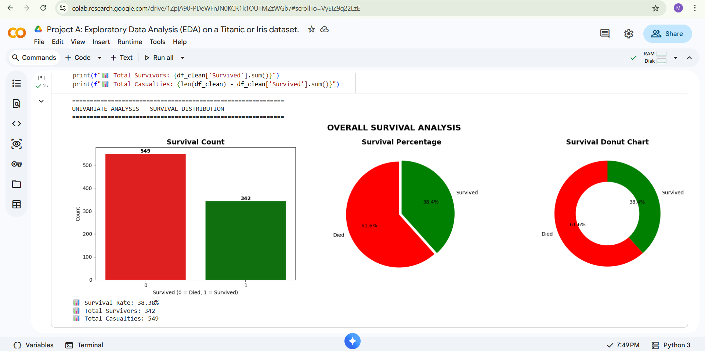
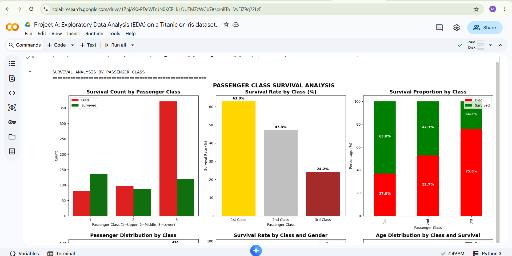
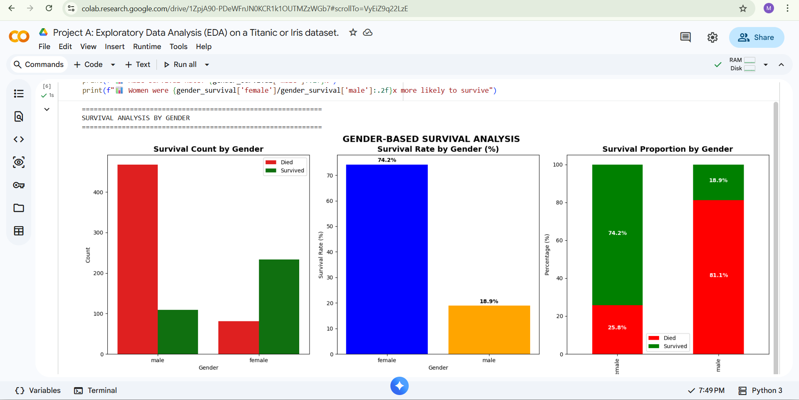
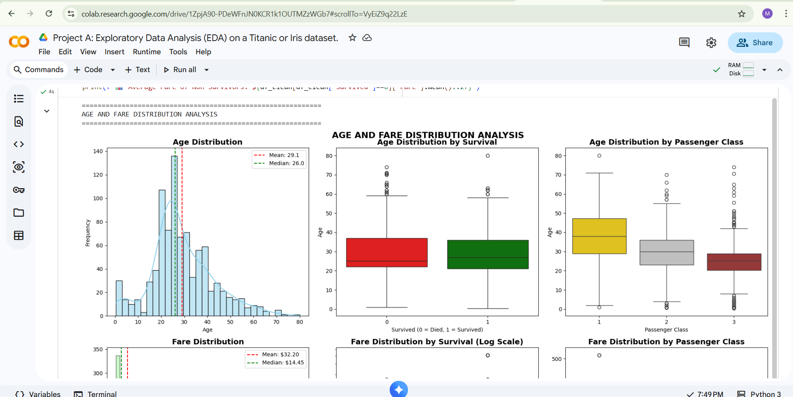
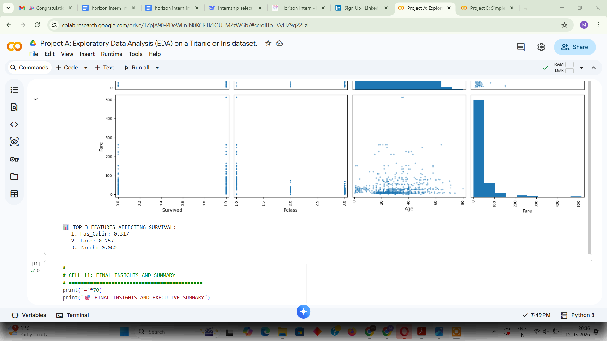
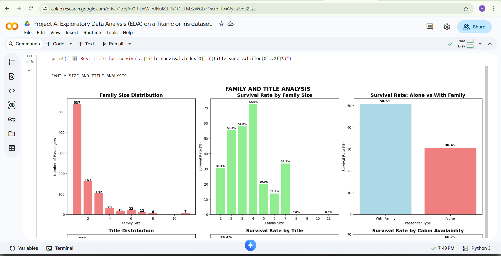

# 🚢 Titanic Exploratory Data Analysis (EDA)

## 📌 Project Overview

This project performs a comprehensive Exploratory Data Analysis (EDA) on the Titanic dataset using Python. The objective is to uncover meaningful insights, identify patterns affecting passenger survival, and demonstrate practical data analysis and visualization skills.

The project covers data cleaning, preprocessing, statistical analysis, feature exploration, and visual storytelling through multiple charts and graphs.

---

## 🎯 Objectives

- Understand passenger demographics and characteristics
- Analyze survival patterns across different groups
- Explore relationships between features
- Visualize trends and distributions
- Extract actionable insights from the dataset

---

## 📊 Dataset Information

The Titanic dataset contains passenger information including:

- Passenger Class (Pclass)
- Name
- Gender (Sex)
- Age
- Fare
- Embarkation Port
- Family Information
- Survival Status

Dataset Source:
- Titanic Dataset (Data Analysis Practice Dataset)

---

## 🛠️ Technologies Used

| Technology | Purpose |
|------------|----------|
| Python | Programming Language |
| Pandas | Data Cleaning & Analysis |
| NumPy | Numerical Computations |
| Matplotlib | Data Visualization |
| Seaborn | Statistical Visualization |
| Plotly | Interactive Charts |
| Jupyter Notebook | Development Environment |

---

## 📈 Analysis Performed

### Data Preprocessing
- Missing value detection
- Missing value handling
- Data cleaning
- Feature engineering

### Exploratory Analysis
- Survival Distribution Analysis
- Gender-Based Survival Analysis
- Passenger Class Analysis
- Age Distribution Analysis
- Fare Distribution Analysis
- Family Size Analysis
- Title Extraction Analysis
- Correlation Analysis

### Visualizations
- Survival Charts
- Passenger Class Charts
- Gender Analysis Charts
- Age & Fare Distribution Charts
- Correlation Heatmap
- Family & Title Analysis Charts

---

## 📷 Project Screenshots

### Overall Survival Analysis


### Passenger Class Analysis


### Gender Analysis


### Age and Fare Distribution


### Correlation Heatmap


### Family and Title Analysis


---

## 🔍 Key Insights

- Female passengers had a significantly higher survival rate.
- First-class passengers were more likely to survive.
- Younger passengers showed different survival patterns compared to older passengers.
- Fare and passenger class had a strong relationship with survival probability.
- Family size influenced passenger survival outcomes.

---

## 📂 Repository Contents

```text
Titanic-Iris-EDA-Project/
│
├── Project_A_Exploratory_Data_Analysis_(EDA)_on_a_Titanic_or_Iris_dataset_.ipynb
├── titanic_cleaned.csv
├── README.md
├── Age and fare distributions.png
├── Correlation heatmap.png
├── Family and title analysis.png
├── Gender analysis charts.png
├── Overall survival charts.png
├── Passenger class analysis.png
└── LICENSE
```

---

## 🚀 How to Run the Project

### Clone Repository

```bash
git clone <repository-link>
```

### Install Dependencies

```bash
pip install pandas numpy matplotlib seaborn plotly jupyter
```

### Launch Jupyter Notebook

```bash
jupyter notebook
```

Open:

```text
Project_A_Exploratory_Data_Analysis_(EDA)_on_a_Titanic_or_Iris_dataset_.ipynb
```

Run all cells to reproduce the analysis and visualizations.

---

## 📋 Project Deliverables

- ✅ Data Cleaning
- ✅ Exploratory Data Analysis
- ✅ Data Visualization
- ✅ Statistical Analysis
- ✅ Documentation
- ✅ GitHub Repository
- ✅ Screenshots

---

## 👨‍💻 Author

**Patibandla Jaswanth**

B.Tech Information Technology Student

Machine Learning | Data Science | Artificial Intelligence Enthusiast

---

## 🏆 Horizon Intern Submission

This project was completed as part of the Horizon Intern Virtual Internship Program.

#horizonintern
